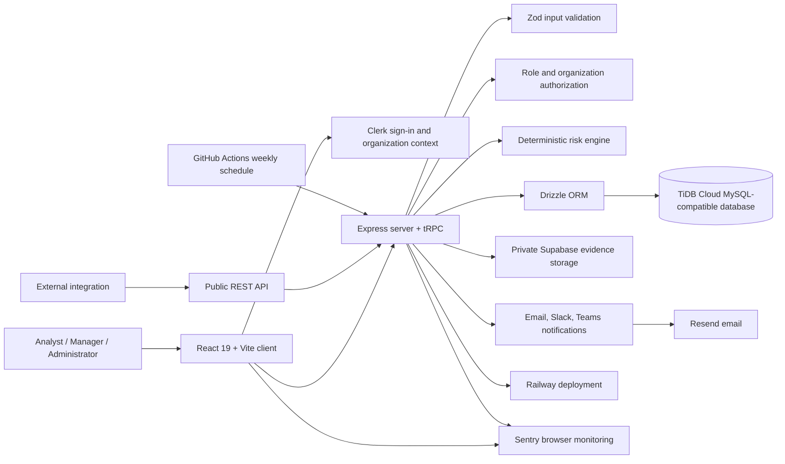

# FraudLens — Interview-Ready Project Guide

> **FraudLens is a multi-tenant fraud-monitoring workspace that helps investigation teams prioritize risky transactions, collaborate on cases, preserve an audit trail, and run the system safely in production.** It is designed as a portfolio demonstration with synthetic data and should not be the sole basis for high-impact decisions.[1]

## 1. The 60-second explanation

FraudLens solves the operational problem that appears after a transaction is flagged: a team needs to know **which case to review first, who owns it, what evidence supports the decision, and how to prove what happened later**. The application combines an explainable deterministic risk assessment with an investigation workspace, organization-level access control, reporting, alerts, and a versioned integration API.

I built it as a full-stack TypeScript application. The browser is a React and Vite client; the server is Express with tRPC; validation is handled with Zod; and persistence is managed through Drizzle ORM and a MySQL-compatible TiDB Cloud database. Clerk handles sign-in and organization membership, Supabase stores private evidence, Resend sends email, Sentry captures privacy-filtered errors, Railway hosts the app, and GitHub Actions delivers scheduled weekly summaries.[1] [2]

The important design choice is that FraudLens is not only a dashboard. It is a **controlled workflow**: authenticate, select an organization, assess or import transactions, investigate a case, record an outcome, notify the right team, report on performance, and retain an auditable history.

## 2. Who uses the system and what each person can do

Every person must sign in and select an active organization before workspace data is available. This keeps one organization’s transactions, evidence, reports, preferences, and API activity separate from another organization’s data.[1]

| User type           | What they can do                                                                                                                                                                                                                          | Why it matters                                                                                               |
| ------------------- | ----------------------------------------------------------------------------------------------------------------------------------------------------------------------------------------------------------------------------------------- | ------------------------------------------------------------------------------------------------------------ |
| **Analyst**         | Review the Command Center, inspect transaction risk factors, update case status, add notes and tags, claim cases, attach evidence, and record confirmed-fraud or legitimate outcomes.                                                     | Analysts can perform the day-to-day investigation without being able to change sensitive workspace settings. |
| **Manager**         | Do everything an analyst can do, plus import CSV transactions, assign owners, set priority and due dates, manage queues and workloads, view reports and audit records, configure alerts and weekly summaries, and create/revoke API keys. | Managers operate the review process and improve queue quality.                                               |
| **Administrator**   | Do everything a manager can do, plus invite members, change application and organization roles, deactivate members, revoke sessions, and revoke pending invitations.                                                                      | Administrators manage access and the organization’s security boundary.                                       |
| **External system** | Submit a transaction to the versioned public API using a scoped Bearer API key.                                                                                                                                                           | Other systems can request the same risk-assessment workflow without using the dashboard.                     |

> **Interview sentence:** “I separated daily investigation work from operational management and membership administration, so people receive only the permissions required for their job.”

## 3. The complete user process, starting from login

### Step 1 — Sign in and select a workspace

The user opens FraudLens and signs in or signs up through Clerk. After authentication, the user selects an active Clerk organization. The server receives the Clerk session, extracts the user ID, organization ID, and organization membership role, then creates or synchronizes a local FraudLens user record if required. The server also resolves the user’s FraudLens role, such as analyst, manager, or administrator.[1] [3]

The application does not rely only on a front-end menu being hidden. Each protected server procedure checks that there is an authenticated user, an active organization, and an appropriate FraudLens role. Administrator actions also require the relevant Clerk organization administrator membership.[1]

### Step 2 — Open the Command Center

After entering the workspace, an analyst starts in the Command Center. It provides a risk overview, recent high-risk alerts, the review queue, and a view of cases that are under review. This helps the user decide what needs attention instead of manually searching every transaction.

### Step 3 — Assess, import, or receive a transaction

There are three supported entry paths:

| Entry path               | What happens                                                                                                      | Typical user                                                  |
| ------------------------ | ----------------------------------------------------------------------------------------------------------------- | ------------------------------------------------------------- |
| **Dashboard assessment** | A user enters validated transaction-risk inputs and receives an explainable risk result.                          | Analyst or manager testing a transaction manually.            |
| **CSV import**           | A manager uploads a validated batch of transactions. The import checks schema and risk inputs before persistence. | Manager onboarding a batch of historical or operational data. |
| **Public API**           | An external service sends `POST /api/v1/transactions/assess` with a scoped Bearer key.                            | Another application or service integration.                   |

The deterministic risk engine evaluates inputs such as amount, merchant category, transaction and account country, device status, transaction hour, and recent transaction count. It creates a score, a risk level, and clear contributing factors. The purpose is explainability: the investigator can see why a transaction was flagged rather than receiving an unexplained label.[1]

### Step 4 — Create a case and prioritize it

When a risk assessment is created, FraudLens creates a case-like transaction record with a status of `under_review`. It assigns a default priority from the risk level: high risk becomes critical, medium risk becomes high, and lower risk becomes standard. Higher-risk cases can receive shorter default due dates, which makes the queue operational rather than only informational.[4]

The same workflow persists the transaction, records an audit event, and evaluates configured notifications. Because the dashboard and the public API use the same submission workflow, the result does not change depending on how the transaction entered the system.[4]

### Step 5 — Investigate the case

The analyst opens the transaction detail view and examines the risk score, individual factors, status, notes, tags, assignment, priority, due date, and linked evidence. The analyst can add a factual note, add or replace tags, claim unassigned work, or collaborate with another investigator.

When supporting material is needed, an authorized user uploads evidence to a **private** Supabase bucket. Files use organization-scoped storage keys and are accessed through the application rather than by making the bucket public. This keeps evidence separate from the normal transaction tables and avoids exposing privileged storage credentials to the browser.[1]

### Step 6 — Resolve the case and learn from outcomes

The analyst records an outcome such as **confirmed fraud** or **legitimate**, together with a resolution reason. This closes the investigation loop and provides data for quality trends. The outcome is a human-reviewed decision recorded with supporting context; the risk score supports review rather than replacing it.[1]

### Step 7 — Manage the operation

Managers assign cases, set priorities and due dates, inspect workloads and queues, and review reporting. Reports can be filtered by risk level, case status, assignee, and date range, then exported as CSV or text. Managers can use the reports to monitor queue age, workload distribution, outcomes, alert quality, and risk patterns.[1]

### Step 8 — Configure alerts and scheduled summaries

Managers or administrators configure a risk threshold and then enable email, Slack, and/or Microsoft Teams or Power Automate notifications only after providing the necessary recipient or approved webhook. A manager-only test action uses a synthetic high-risk transaction so the team can test delivery without sending live transaction data.[1]

For recurring reporting, managers or administrators can enable weekly summaries. GitHub Actions runs the delivery workflow every Monday at 08:00 UTC, calculates the previous completed calendar week, and sends an idempotent summary through Resend. The idempotency record prevents a retry from intentionally delivering the same organization-week summary twice.[1]

### Step 9 — Integrate another application through the API

A manager creates an organization-scoped API key and gives the newly generated secret to the calling system only once. FraudLens stores a hash and a short key prefix instead of the plaintext secret. The integration sends a Bearer key with the `transactions:write` scope to `POST /api/v1/transactions/assess`.[1]

The API validates the request, applies the same deterministic assessment workflow as the dashboard, returns a request ID for diagnostics, and supports idempotency through a transaction reference. A duplicate reference in the same organization returns `409`, allowing an integration to avoid creating duplicate cases when it retries.[1]

### Step 10 — Audit, protect, and recover

Sign-in access, case activity, notification changes, membership administration, and API activity are captured as organization-scoped audit or request-log records. Audit events are append-only by default. The operational runbook requires a controlled export, review, and approval process before destructive retention actions.[2]

## 4. Technical architecture



| Layer            | Main technology                                        | Responsibility                                                                                                                      |
| ---------------- | ------------------------------------------------------ | ----------------------------------------------------------------------------------------------------------------------------------- |
| **Client**       | React 19, Vite, Tailwind CSS, React Query, tRPC client | Responsive dashboard, navigation, forms, filters, role-aware controls, and user feedback.                                           |
| **Server**       | Express, tRPC, Zod                                     | Authenticated request handling, input validation, authorization, workflow orchestration, and API responses.                         |
| **Data**         | Drizzle ORM, MySQL-compatible TiDB Cloud               | Multi-tenant users, transactions, notes, tags, evidence metadata, audit events, preferences, API keys, request logs, and summaries. |
| **Identity**     | Clerk                                                  | Sign-in, sign-up, sessions, organizations, invitations, and organization membership roles.                                          |
| **File storage** | Supabase Storage                                       | Private evidence objects with organization-scoped paths.                                                                            |
| **Integrations** | Resend, Slack, Teams/Power Automate, Sentry            | Notification delivery and privacy-aware monitoring.                                                                                 |
| **Delivery**     | Railway, GitHub Actions                                | Production hosting, health checks, migrations, CI, and scheduled weekly summaries.                                                  |

## 5. Data and decision flow

The key flow is intentionally shared across dashboard and API assessments:

1. A request is authenticated and associated with the active organization.
2. Zod validates the request shape and bounds values before business logic runs.
3. The deterministic risk engine calculates the score, risk level, and explanation factors.
4. FraudLens creates the review record with status, priority, and due-date defaults.
5. Drizzle persists the record under the organization ID.
6. The server writes an audit event identifying the action source: dashboard or public API.
7. Notification evaluation runs without blocking storage of the core risk decision.
8. An investigator adds evidence and collaboration context, then records the final outcome.
9. Management reports and weekly summaries aggregate the organization’s reviewed operational data.

> **Interview sentence:** “I treated a fraud flag as the beginning of a workflow, not the end of one. The score creates a prioritized review item, while people add evidence, make the final outcome decision, and leave an audit trail.”

## 6. Security, privacy, and reliability decisions

| Area                | What FraudLens does                                                                                                                                   | Interview value                                                                 |
| ------------------- | ----------------------------------------------------------------------------------------------------------------------------------------------------- | ------------------------------------------------------------------------------- |
| **Authentication**  | Uses Clerk sessions rather than writing custom password handling.                                                                                     | Reduces the risk and maintenance burden of home-grown authentication.           |
| **Authorization**   | Enforces active organization and role checks in server-side procedures; administrator work also requires Clerk organization administrator membership. | Protects against cross-tenant access and front-end-only authorization mistakes. |
| **Tenancy**         | Filters organization-scoped operations by the active organization ID.                                                                                 | Shows that isolation is designed into the request and data model.               |
| **Secret handling** | Keeps database URLs, Clerk secrets, Supabase service-role keys, Resend keys, and monitoring tokens in environment variables or deployment secrets.    | Demonstrates secure configuration discipline.                                   |
| **Evidence files**  | Uses private object storage and organization-scoped keys; the service-role key remains server-only.                                                   | Avoids public evidence URLs and client-side privileged credentials.             |
| **API protection**  | Hashes API secrets, scopes keys, reveals a new secret once, supports revocation, enforces per-key rate limits, and returns request IDs.               | Makes integration access safer and diagnosable.                                 |
| **HTTP hardening**  | Applies Helmet, disables the Express fingerprint header, uses bounded parsers, and rate-limits `/api` traffic.                                        | Shows production-oriented server hardening.                                     |
| **Auditability**    | Records append-only audit events and avoids automatic destructive retention.                                                                          | Supports investigation traceability.                                            |
| **Monitoring**      | Uses optional browser and server monitoring with privacy filters for identities, cookies, headers, bodies, query strings, and sensitive breadcrumbs.  | Balances observability with privacy.                                            |
| **Recovery**        | Uses backups plus recurring logical exports, tests restore into a new isolated database, then cuts over only after validation.                        | Shows that recovery is a process, not just a backup checkbox.                   |

The production defaults include a 1 MB JSON/form body limit, a global API limit of 300 requests per client IP per 15-minute window, and a public API-key limit of 60 requests per minute. Evidence is transferred directly to private object storage instead of increasing the server body limit.[2]

## 7. Local development and production deployment

### Local development process

```powershell
git clone https://github.com/Sanika1356/FraudLens.git
cd FraudLens
pnpm install
Copy-Item .env.example .env
pnpm db:push
pnpm dev
```

The Windows-compatible `pnpm dev` command runs `scripts/dev.ts`, so it does not depend on Unix-only `NODE_ENV=...` syntax. Before merging or deploying a change, run the quality gate:

```powershell
pnpm format:check
pnpm check
pnpm test
pnpm build
```

### Production release process

1. A change is created on a focused branch and reviewed through a pull request.
2. GitHub Actions checks formatting, TypeScript, tests, and the production build.
3. The protected `main` branch is merged only after CI succeeds.
4. Railway builds the application, applies committed Drizzle migrations before startup, and starts the Express service on the Railway-assigned port.
5. Railway variables provide production secrets; the application fails closed when the required database or Clerk variables are absent.
6. The operator checks `GET /health` and expects `200` with `{"status":"ok"}` before routing users to the release.
7. The exact Railway HTTPS domain is added to Clerk allowed origins and redirect URLs, then sign-in and an authorized route are tested.[1] [2]

## 8. A practical interview demo script

Use this sequence if an interviewer asks you to demonstrate the project.

| Demo order | What to show                                       | What to say                                                                                                                                             |
| ---------: | -------------------------------------------------- | ------------------------------------------------------------------------------------------------------------------------------------------------------- |
|          1 | Sign-in and organization selection                 | “Authentication and workspace selection are separate because every data request is scoped to the active organization.”                                  |
|          2 | Command Center and high-risk queue                 | “This is the operational view: it shows what requires review now rather than only showing raw transactions.”                                            |
|          3 | A transaction detail page                          | “The score is deterministic and explainable. I show the factors so the investigator understands why it was flagged.”                                    |
|          4 | Case note, tag, assignment, priority, and due date | “The application turns an alert into an owned investigation workflow.”                                                                                  |
|          5 | Evidence upload                                    | “Evidence stays in private, organization-scoped storage; I do not expose the storage credential to the client.”                                         |
|          6 | Outcome and reports                                | “Human reviewers record the outcome, and managers can use aggregated reports to improve queue operations.”                                              |
|          7 | Notification preferences or weekly summaries       | “Managers control the alert threshold and channels, and scheduled summaries are idempotent to avoid duplicate delivery.”                                |
|          8 | API Keys and endpoint documentation                | “External systems use scoped, revocable keys. I hash the secret and support idempotent request references.”                                             |
|          9 | Administrator directory and audit log              | “Administrators can manage access, while audit records make sensitive actions reviewable.”                                                              |
|         10 | Railway health endpoint and CI                     | “I treated deployment and recovery as product features: I have a health check, fail-closed startup validation, CI, monitoring, and a recovery runbook.” |

## 9. Strong interview answers

### “Why did you choose a deterministic risk engine?”

“For this project, explainability and predictable behavior were more important than pretending to have a trained production model. The engine uses clear inputs and produces explicit factors, so an investigator can challenge or verify a result. I also added outcome feedback and quality trends as a foundation for future model evaluation, while keeping the human reviewer responsible for final decisions.”

### “How do you prevent one company from seeing another company’s information?”

“Users must select an active organization. The server context carries the authenticated user, organization ID, and organization membership role. Protected procedures require an active organization and filter organization-scoped reads and writes by that ID. This is enforced server-side, not just by hiding screens.”

### “How did you secure evidence files?”

“I used a private Supabase bucket with organization-scoped object keys. The privileged service-role key stays only on the server. Authorized users receive access through the application workflow, not by making the bucket public.”

### “How did you make the API safe for integrations?”

“Keys are organization-scoped, scoped by permission, stored as hashes, shown once, and revocable. The API validates input, gives request IDs for diagnosis, limits usage per key, and supports idempotency through a client reference to make retries safe.”

### “What happens when production configuration is wrong?”

“The production server validates required database and identity variables at startup and fails closed rather than accepting traffic in a broken or insecure state. After deployment, I verify the health endpoint and test authentication against the deployed domain.”

### “What would you improve next?”

“I would add a shared rate-limit store before horizontal scaling, broaden automated end-to-end coverage, build a formal model-monitoring pipeline from verified outcomes, and complete a security and compliance review before handling real regulated data.”

## 10. Honest scope and limitations

FraudLens is a strong portfolio demonstration, but a responsible explanation must include its limits:

1. It uses synthetic records and is not a complete regulated-production fraud platform.
2. The risk engine is deterministic and explainable; it is not a trained machine-learning model or an automated adverse-action system.
3. The current global HTTP rate limiter is in memory and should be replaced with a shared store before running multiple service instances.[2]
4. Retention periods, regulatory obligations, and use of real customer data require qualified legal, privacy, security, and compliance review.[1] [2]
5. TiDB Cloud Starter backup retention is limited, so recurring logical exports and restore exercises are part of the operational process.[2]

Being clear about these boundaries is a strength in an interview. It shows that you understand the difference between a well-engineered portfolio project and a regulated production environment.

## 11. Final two-minute answer to memorize

“FraudLens is a full-stack, multi-tenant fraud-monitoring workspace. It helps investigation teams review risky transactions through an explainable scoring workflow, case assignment, evidence handling, outcome recording, alerts, reports, and an integration API. I used Clerk for authentication and organization membership, React and Vite for the user interface, Express with tRPC and Zod for secure server workflows, Drizzle with TiDB Cloud for persistence, Supabase for private evidence, and Railway plus GitHub Actions for delivery and scheduled summaries.

The most important part is that I designed it as an operational workflow rather than only a dashboard. A user signs in, selects an organization, creates or receives a risk assessment, investigates the factors, attaches evidence, records a human-reviewed outcome, and leaves an audit trail. Managers can control queues, reporting, alerts, and API keys, while administrators control membership and sessions. I also included fail-closed startup validation, rate limiting, private storage, monitoring, health checks, CI, backups, and a recovery runbook. For a real regulated deployment, I would add a shared rate-limit store, strengthen automated testing, and complete formal security and compliance review.”

## References

[1]: https://github.com/Sanika1356/FraudLens/blob/main/docs/ADMINISTRATOR_GUIDE.md "FraudLens Administrator Guide"
[2]: https://github.com/Sanika1356/FraudLens/blob/main/docs/OPERATIONS.md "FraudLens Production Operations Runbook"
[3]: https://github.com/Sanika1356/FraudLens/blob/main/server/_core/context.ts "FraudLens authentication context"
[4]: https://github.com/Sanika1356/FraudLens/blob/main/server/routers.ts "FraudLens application router"
[5]: https://github.com/Sanika1356/FraudLens/blob/main/package.json "FraudLens package manifest"
